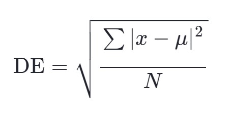
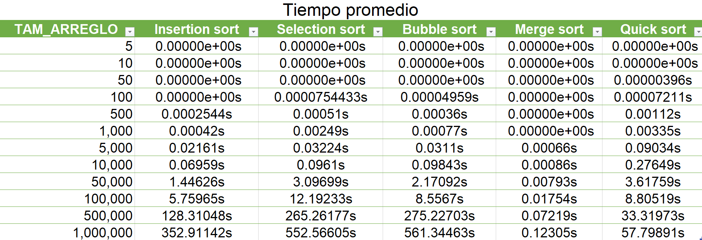
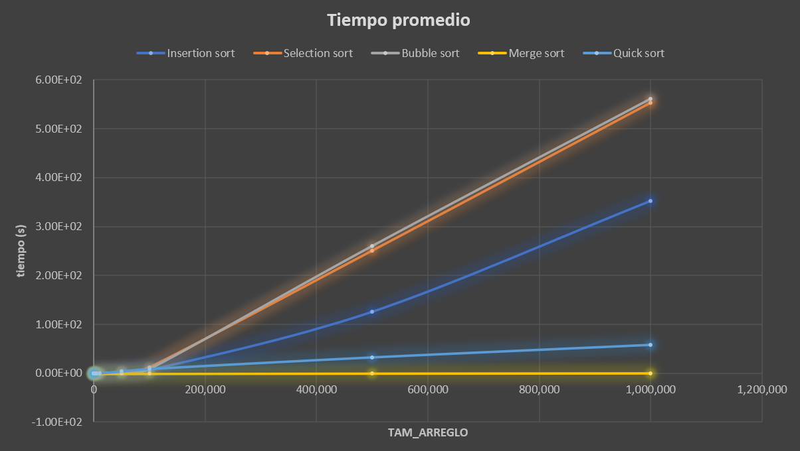
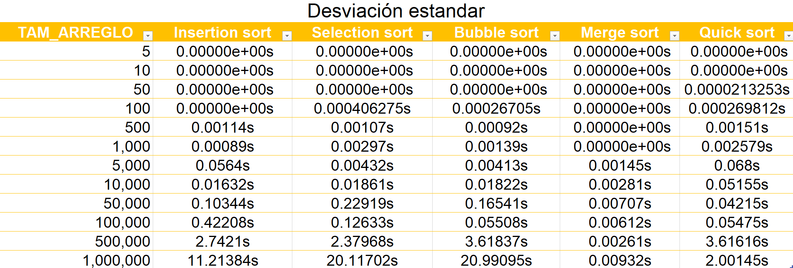
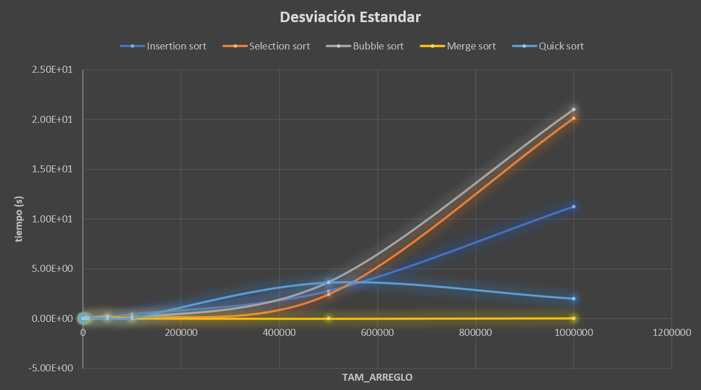
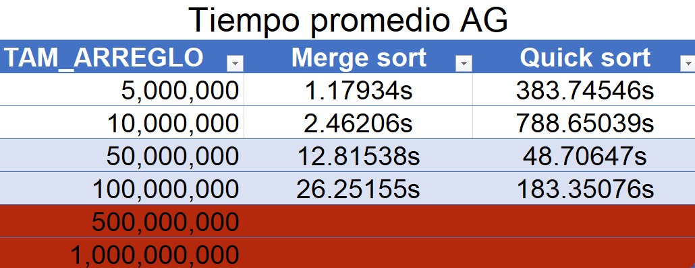
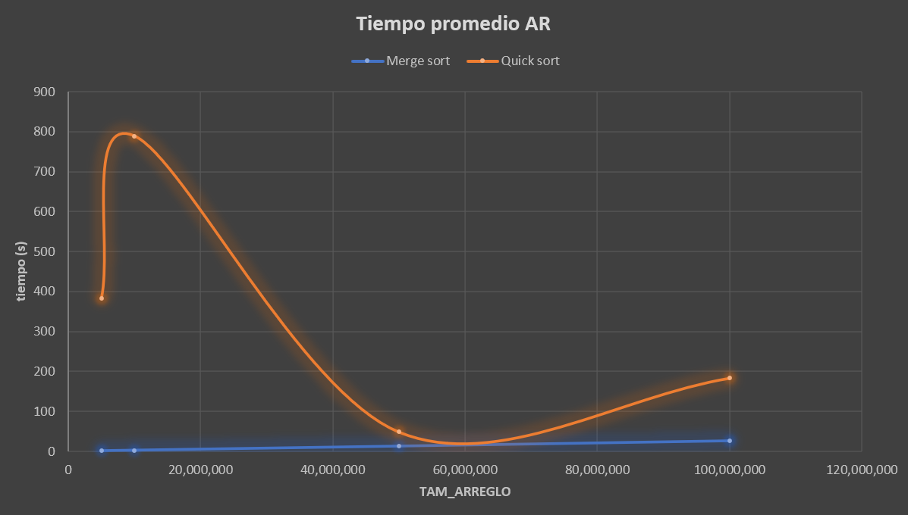
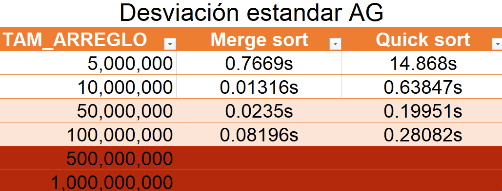
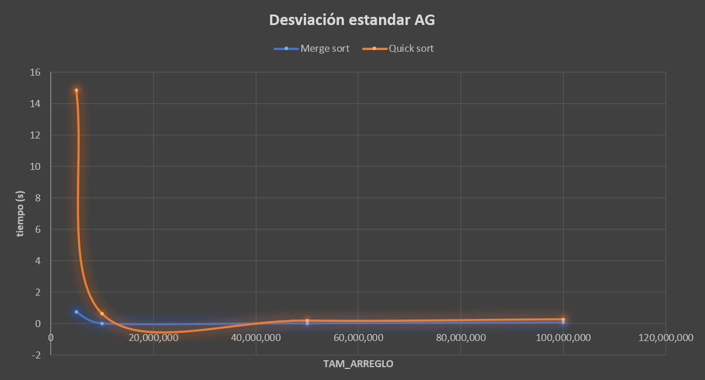

# Práctica 4: Algoritmos de ordenamiento

Lo primero que hice para poder empezar mi código fue revisar los archivos .h que se compartieron en github, en un solo código junté los 5 algoritmos que serían necesarios, los cuales son insertion sort, selection sort, buble sort, marge sort y quicksort.

Después con ayuda del código .cpp que igual se compartió en github comencé a modificarlo, deje las funciones que miden el tiempo de ejecución del algoritmo, e igual deje la función copiar arreglo.

Agregue otra función para poder imprimir la tabla, trate de hacerlo como se sugirió, use un ciclo if para que la primera repetición imprimiera los encabezados de la tabla, después para imprimir el tiempo puse if para que lo imprimiera en notación científica. Si el tiempo es menor que 0.00009, pero si el tiempo es mayor entonces se imprimirá en notación fija. Esto se hace para que tenga mejor precisión al imprimir el tiempo. En la misma función va imprimiendo los resultados que va generando actualmente conforme al número de repeticiones que indique.

Agregue otra función para calcular la desviación estándar la cuál se realiza con la siguiente fórmula:

En este caso, el símbolo de sumatoria se refiere a la suma de todos los tiempos, x es el valor de tiempos [i], μ es el tiempo promedio y N es el número de repeticiones.
Para poder realizar esto inicialice en 0 dos variables sumatoria y t_promedio, con un ciclo for se iba calculando el promedio de los tiempos, la variable sumatoria ayudaba a sumar el total de tiempos, después el resultado de estos se divide entre el numRepeticiones, después se calcula la diferencia cuadrática, lo hice con un ciclo for, declare otra variable dif restando tiempos[i] – t_promedio y después solo multiplique la diferencia por la diferencia. Se declara otra variable para dividir ya la sumatoria y la diferencia cuadrada entre el número de repeticiones. Para sacar la raíz del resultado que nos diera solo utilice la biblioteca cmath y así puede hacer uso de sqrt y ya solo regresa la desviación estándar.

También conserve la función experimentos y con esta misma me fui guiando, solo agregue los algoritmos faltantes haciendo lo mismo como estaba solo cambiándole los nombres. Después de calcular los promedios de los tiempos de ejecución, solo dividí la suma que se acumuló de todos los tiempos de ejecución entre las repeticiones que se realizaron. Al final de esta función solo mandará a imprimir los resultados del promedio de tiempos y la desviación estándar.

Finalmente, esta es la función principal y lo que esta realiza es por medio de ciclos if, si el número de argumentos es diferente que dos mandará a imprimir un mensaje y en caso de que no se cumpla, si se da el tamaño del arreglo, la función mostrará el tamaño del arreglo y mandará a llamar a la función experimentos con el tamaño del arreglo que se desea realizar.

Una vez hecho el código comencé a probar con los arreglos.

El arreglo de 5 y de 10 corre en segundos y solo genera tiempos de 0.

El arreglo de 50 también corre en segundos, igual genera tiempos de 0, pero en el quick sort ya marca valores.

Pasamos al arreglo de 100 corre en segundos y a partir de aquí se notó la diferencia, ya que aumento el tiempo en los algoritmos selection sort, quick sort y un poco en bubble sort.

El siguiente arreglo de 500 salen los resultados en segundos, igual va aumentando poco a poco, y lo que hasta este se puede observar es que el merge short sigue en 0, mientras que el selection ya lleva un mayor tiempo de ejecución.

Los arreglos de 1,000 y de 5,000 se siguen generando rápido, hay incremento de tiempos y se observa que selection sort es el tiempo más alto.

A partir del arreglo de 10,000 comienza a tardar, pero muy poco. Se tarda en generar los resultados alrededor de 18 segundos.

En el arreglo de 50,000 comenzó a notarse la diferencia de tiempo de espera. Se tarda en generar los resultados alrededor de 4 minutos y medio.

En el arreglo de 100,000 tarda todavía más, los resultados los genera aproximadamente en 15 minutos.

Cuando iba a correr el arreglo de 500,000 se me cerraba el programa después de un rato de comenzar a correrlo, entonces se cambió de compilador. En este momento me di cuenta que dependiendo del compilador también varean los tiempos de ejecución.

El arreglo de 500,000 aumentó más de tiempo, cada línea en generarse tarda aproximadamente 11 minutos, y en sacar todos los resultados tardó como 6 horas.

En el arreglo de 1,000,000 ya se complicó más, cada línea tardaba alrededor de 30 minutos, y tardó como 14 horas en terminar.

Al intentar correr el arreglo de 5,000,000 ya no cargaba nada en mucho tiempo, entonces decidí eliminar los algoritmos de insertion sort, selection sort y bubble sort, ya que estos eran los que más se tardaba en calcular.

Lo que cambié en el archivo .cpp fue eliminar todas las partes que involucraban insertion, selection y bubble, al igual que en el archivo .h solo eliminé estos algoritmos.
Entonces el arreglo de 5,000,000 sólo se corrió con el marge short y el quick sort, en generar una línea tardó aproximadamente 8 minutos, y en total tardó más de 4 horas en sacar los resultados.

El arreglo de 10,0000,000 tardó en generar una línea alrededor de 12 minutos, en total tardó como 6 horas.

El arreglo de 50,000,000 lo intenté hacer igual con el marge sort y el quick sort, pero cada línea la genera cada 3 horas aproximadamente, lo empecé a correr ayer 29 de enero a las 3:24 pm, considerando el tiempo que tarda cada línea los resultados saldrían en 3 días, entonces decidí calcular los valores de marge sort y quick sort individualmente y noté que el tiempo de ejecución al hacerlo independiente es mucho menos como se observa en la gráfica, tardó como 30 minutos en salir los resultados.

En esta parte volví a modificar el código y ahora solo deje un algoritmo y elimine lo relacionado con el otro y al revés para calcular el algoritmo faltante, igual modifique como se imprime la tabla para que saliera de la forma correcta.

Para que el arreglo de 10,000,000 realice lo mismo que con el de 50 millones, a pesar de que tardan no tiene comparación con lo que tarda haciéndolos juntos, tardó como 1 hora para que salieran los resultados.

Finalmente están los arreglos de 500,000,000 y 1,000,000,000 los cuales no pude correrlos, intenté con 3 compiladores diferentes y solo me cierra el programa, entonces ya no pude realizarlos.

CONCLUSIÓN.

Para esta práctica hice uso de 3 computadoras, 2 de estas tienen un procesador AMD Ryzen 5 3500U, con 8 GB de RAM, Windows 11,64 bits y un SSD de 512GB. 
La otra computadora tiene un procesador Intel Core i5 1135G7, con 8GB de RAM, Windows 10, 64 bits y un SSD de 256 GB.

Utilice 3 equipos para poder avanzar más rápido ya que los tiempos de espera eran tardados, pero nunca separe el algoritmo, siempre ingrese un tamaño de arreglo específico y en la maquina se ejecutaba, en la parte que si separé el algortimo que fue para los arreglos más grandes se genero en la misma computadora.

Intente correr el arreglo de 500,000,000 y 1,000,000,000 pero debido al tamaño ya no pueden ejecutarse, pienso que ya no sé puede debido a que estos arreglos ya son muy grandes y puede ser que la forma de que se puedan sacar los resultados de estos arreglos tan grandes sea que se tome la parte más eficiente del código y se divida correr los programas en partes más pequeñas para que vaya liberando espacio de memoria y no se agote.

Al observar las gráficas y medir los tiempos podemos darnos cuenta que para los arreglos pequeños estos algoritmos son eficientes, pero ya no funcionan bien cuando son más grandes, por ejemplo, bubble sort entre más se usa menos eficiente será, esto se debe a que como compara todos los elementos de la lista en cada iteración. Por otro lado, se observa que merge sort es más eficiente, esto se debe a que este divide el arreglo en dos mitades, ordena cada mitad de forma recursiva para después juntar las dos mitades ya ordenadas.

Los algoritmos ordenamiento son menos eficientes que los algoritmos recursivos de ordenamiento porque estos tienen una complejidad de (O(n ^2)), mientras que los recursivos tiene  una complejidad de (O(n log n)). Aunque también con los resultados podemos observar que insertion sort con (O(n)) para algunos casos puede ser más rápido. En general los algoritmos recursivos son más eficientes para arreglos más grandes.

